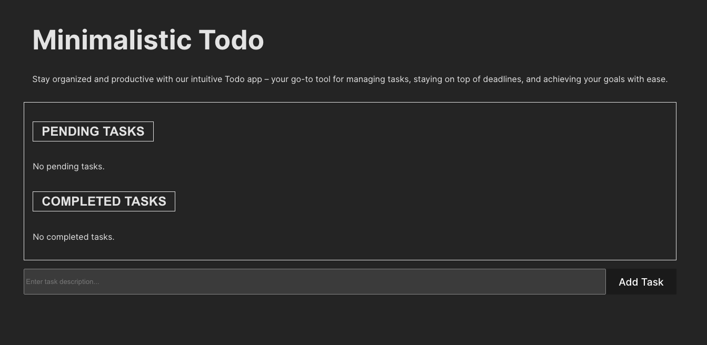
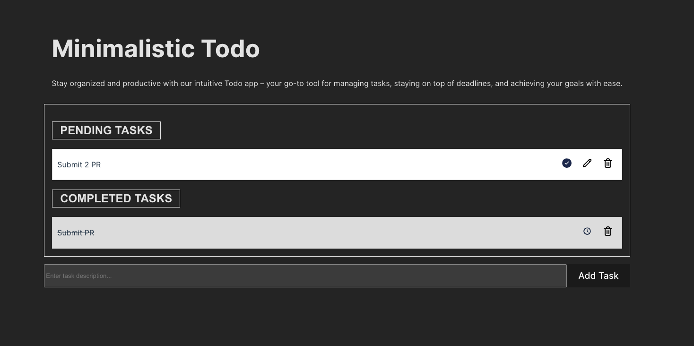
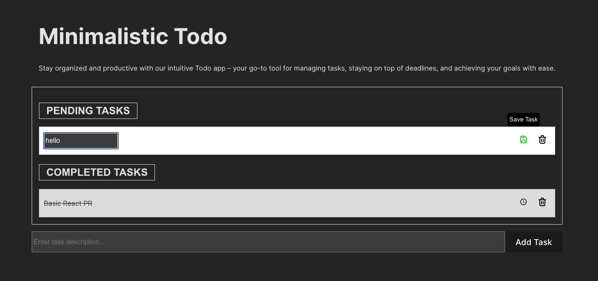
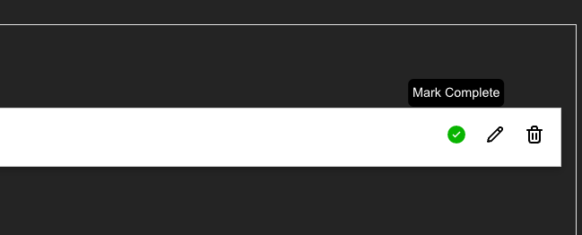
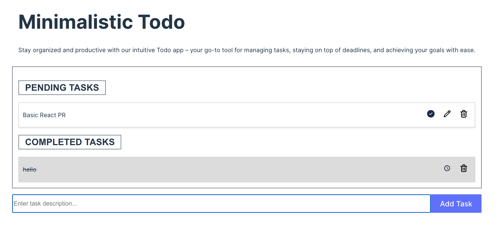

# React Todo App

This To-do app is a simple task management application built using basic React concepts. Users can add, remove, edit, and mark tasks as done, providing a straightforward solution for organizing their tasks efficiently.

## Features

-   **Add a Task**: This feature allows users to add new tasks to their to-do list. Users can input the task description in a designated input field and press the "Add" button or hit Enter to append the task to the list.

-   **Remove a Task**: Users can delete tasks from the list. Each task item typically includes a delete button or an icon that users can click to remove the task from their list.

-   **Edit Task**: Users can modify the content of existing tasks. This functionality enables users to update task descriptions. Typically, users can initiate the editing process by clicking on the task item or an "Edit" button, which opens an inline editor.

-   **Mark as Complete**: This feature allows users to mark tasks as completed once they've finished them. Users can typically do this by clicking on a checkbox, a button, or an icon next to the task item. A completed task may be visually differentiated from incomplete tasks to provide clear feedback to the user.

-   **Clean UI/UX**: The To-do app prioritizes providing a clean, intuitive, and user-friendly interface. This includes clear and concise task management controls, minimalistic design elements, responsive layouts for different screen sizes, and intuitive interactions to streamline the user experience. The UI/UX design aims to enhance productivity and minimize cognitive load for users, ensuring that managing tasks is efficient and effortless.

## Screenshots

_No Tasks_



_Available Tasks_



_Edit the Task and Save it_



_Tooltip for better navigation_



_Light Mode_



## Setup

To run the application locally, follow these steps:

1. Clone the repository:

    ```
    git clone this repository
    ```

2. Navigate to the project directory:

    ```
    cd react-todo
    ```

3. Install dependencies:

    ```
    npm install
    ```

4. Start the development server:
    ```
    npm run dev
    ```

## Usage

Once the development server is running, open your browser and navigate to the locally deployed environment to use the application.

-   To add a task, type the task description in the input field and press enter or click the add task button.
-   To remove a task, click on the delete button next to the task.
-   To edit a task, double-click on the task text, and make your changes, and to save click outside the input or click on the save button.
-   To mark a task as done, click on the check icon next to the task.
-   To mark a task as pending again, click on the pending icon next to the completed task.

## Changes Made:

-   Created components for adding, removing, editing, and marking tasks as done.
-   Implemented functionality to add, remove, edit, and mark tasks as done.
-   Configured ESLint and Prettier for code quality and formatting.
-   Styled the UI/UX for improved user experience.

## Requirements

-   ESLint Configuration: The project is configured with ESLint to enforce coding standards. Any coding style can be used, but consistency is maintained throughout the codebase.
-   Prettier Configuration: Prettier is configured to ensure consistent code formatting, enhancing code readability and maintainability.
-   Functional UI/UX: The user interface is designed to be functional, providing a seamless experience for task management.

## Technologies Used

The To-do app is built using the following technologies and libraries:

-   React
-   ESLint
-   Prettier

## Deployment

The application is deployed using Vercel. You can access the deployed app using the URL in the description.
